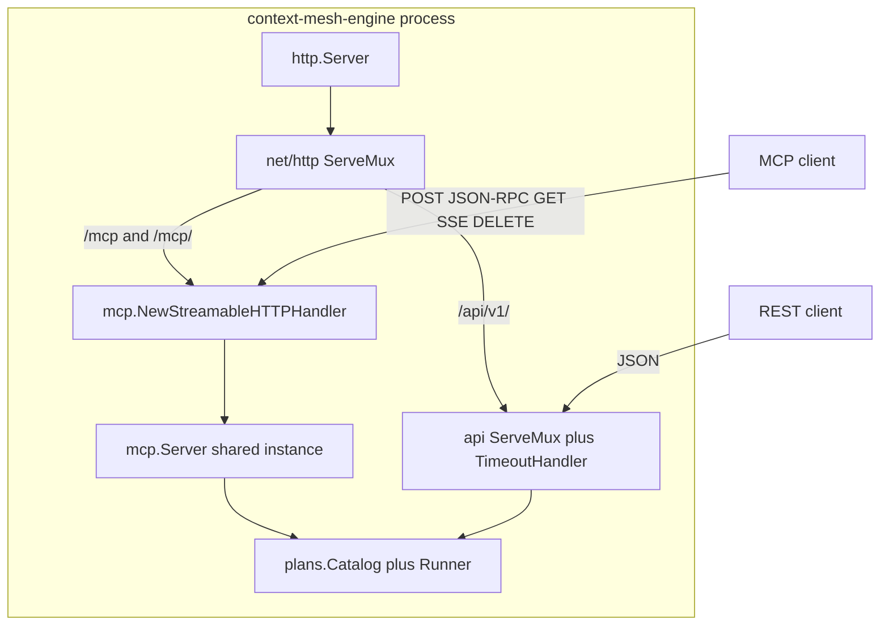

# Code design

This document is for **contributors**. SDK usage lives in [docs/users/usage.md](../users/usage.md).

## Goal

Share one `http.Server` between:

1. MCP Streamable HTTP (SSE + POST) at `/mcp`
2. JSON REST at `/api/v1/`

using [go-sdk](https://github.com/modelcontextprotocol/go-sdk) as the MCP library.

## Why we do not extend the go-sdk listener

Remote MCP in go-sdk is already an `http.Handler`:

- `mcp.NewStreamableHTTPHandler` — current spec (**this** engine)
- `mcp.NewSSEHandler` — deprecated 2024-11-05 transport (not mounted)

go-sdk examples often pass that handler to `http.ListenAndServe` as the **root** handler. We own the server and mount the SDK handler as one sibling route, the same way [examples/auth/server](https://github.com/modelcontextprotocol/go-sdk/blob/main/examples/auth/server/main.go) mounts `/mcp`.

`mcp.Server.Run` is the other launch path (stdio / one session). Do not call it here.

## Architecture

One `mcp.Server` is reused for every session. `getServer` in `NewStreamableHTTPHandler` always returns that instance (`internal/mcpgw`). Sessions live inside the handler, keyed by `Mcp-Session-Id`.

When Arazzo loaders are set, MCP `run_*` tools and REST plan handlers share `internal/plans.Runner`.

## Streamable HTTP

Stateful `StreamableHTTPHandler.ServeHTTP` (go-sdk `mcp/streamable.go`):

| Method | Role |
| --- | --- |
| POST | JSON-RPC. First POST without `Mcp-Session-Id` creates a session. Default response is `text/event-stream`. |
| GET | Standalone SSE for server-initiated messages. Requires session id + `Accept: text/event-stream`. |
| DELETE | Close session. |

`internal/mcpgw` must keep:

- `Stateless` **false**. Stateless mode returns 405 on GET.
- `JSONResponse` **false**. True forces JSON POST responses and drops streaming.

`SessionTimeout` from `engine.Options` is passed through as `StreamableHTTPOptions.SessionTimeout`.

Do not add `mcp.NewSSEHandler` unless a later phase needs 2024-11-05 clients.

## Mux rules (invariants)

Tests in `engine/engine_test.go` encode the first four.

1. **Sibling mount.** MCP and REST are two children of the root mux. REST middleware must not wrap `/mcp`.
2. **No `StripPrefix` on `/mcp`.** Advertise `http://host:port/mcp`. Extra path under `/mcp/` still hits the same handler; go-sdk ignores the path.
3. **REST timeout only.** `http.TimeoutHandler` wraps the `/api/v1` mux (`APITimeout`, default 15s; negative disables). It wraps `ResponseWriter` and would break SSE if applied globally. Timeout body is plain text `request timeout\n`, not JSON.
4. **No short `WriteTimeout`** on `http.Server`. GET SSE is a long write. `ReadHeaderTimeout` default 10s.
5. **No Gin (or other buffering wrappers) on the root handler.** They often hide `http.Flusher` / hijack. Chi, if ever added, belongs **under `/api/v1` only**.
6. **Root mux is stdlib `ServeMux`.** Method-aware patterns on the REST child mux.

`internal/httpserver.NewMux` implements these rules. Change it together with `engine/engine_test.go`.

`/api/v1` is mounted as `StripPrefix("/api/v1", apiHandler)`, so controllers see `/health` not `/api/v1/health`. Generated OpenAPI `paths` are likewise **without** `/api/v1`.

## Package split

| Package | Owns |
| --- | --- |
| `internal/mcpgw` | shared `mcp.Server` + `NewStreamableHTTPHandler` |
| `internal/httpserver` | root mux, `ListenAndServe`, `Shutdown` (10s) |
| `internal/api` | JSON encode/decode |
| `internal/api/v1` | REST mux, health, plans HTTP |
| `internal/plans` | catalog, runner, MCP registration, OAS JSON |
| `engine` / `api` / `arazzo` | public facades |

## Lifecycle

1. `engine.New` applies defaults, constructs `mcpgw.Gateway` and `apiv1.Router`, registers health. If `ArazzoLoaders` is non-empty: validate tool-doc templates, `plans.Load`, `plans.RegisterMCP`, register `PlansController`. Any of those errors fail `New`.
2. Caller may `mcp.AddTool` on `Engine.MCP()` and `AddController`.
3. `Handler()` calls `httpserver.NewMux` once.
4. `ListenAndServe` binds TCP, serves, and on context cancel calls `Shutdown` (10s) then `Close` if shutdown fails. In-flight GET SSE ends when request contexts cancel.

Catalog load uses `context.Background()` inside `New` (not a caller-supplied ctx).

## Middleware policy

Safe on the **root** handler: logging that does not wrap `ResponseWriter` or buffer the body.

Unsafe on the root handler: `TimeoutHandler`, gzip, CORS wrappers that buffer, Gin, auth that should apply to only one subtree.

MCP already validates `Content-Type` / `Accept` and applies localhost DNS-rebinding protection. REST `Content-Type` enforcement is not applied globally; add it on `/api/v1` only if needed.

## Adding a REST controller

Implement `api.Controller.Register(*http.ServeMux)`. Routes are relative to `/api/v1`. Register via `Engine.AddController`. Prefer before serve.

Built-in plan routes are registered inside `New` when loaders are set (`internal/api/v1/plans.go`). Do not duplicate those patterns.

## Adding MCP features

Use go-sdk APIs on `Engine.MCP()`: `mcp.AddTool`, `Server.AddPrompt`, `Server.AddResource`. Plan tools are registered in `internal/plans/mcp.go`; changing names/schemas belongs there plus `engine/arazzo_test.go`.

## Changing Arazzo behavior

Follow [arazzo.md](arazzo.md). Do not call `RunWorkflow` on a shared `arazzo.Engine`. Do not parse OpenAPI files with `FileLoader` in testdata (loader root is `testdata/arazzo/plans` only).

## Out of scope

- OAuth / `auth.RequireBearerToken` (wrap MCP only if added later)
- Legacy SSE transport
- A shipping HTTP `Executor` (apps provide one)
- Implemented `query` tool
- Changes under the `go-sdk` or `libopenapi` checkouts unless you are contributing to those repos
