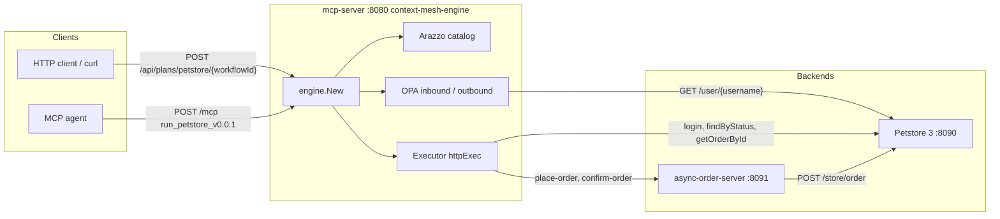
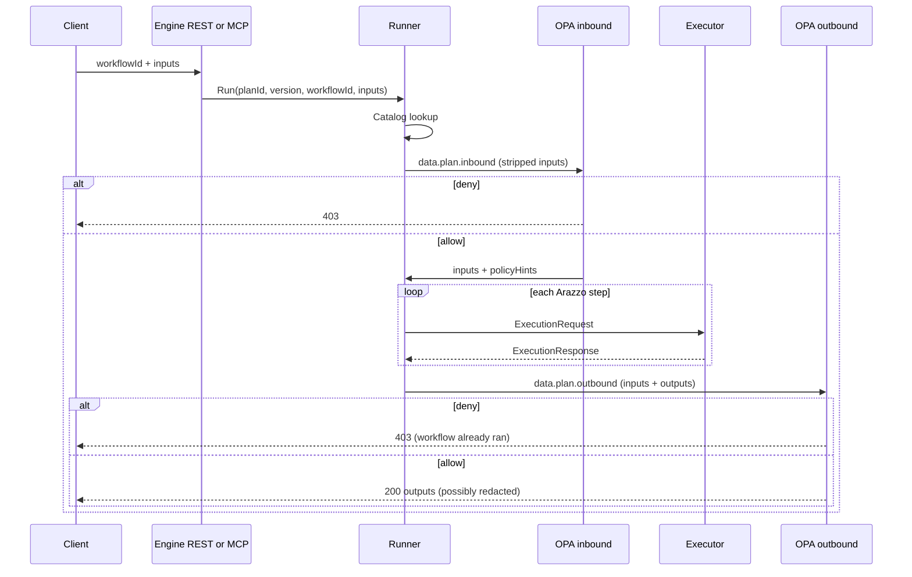
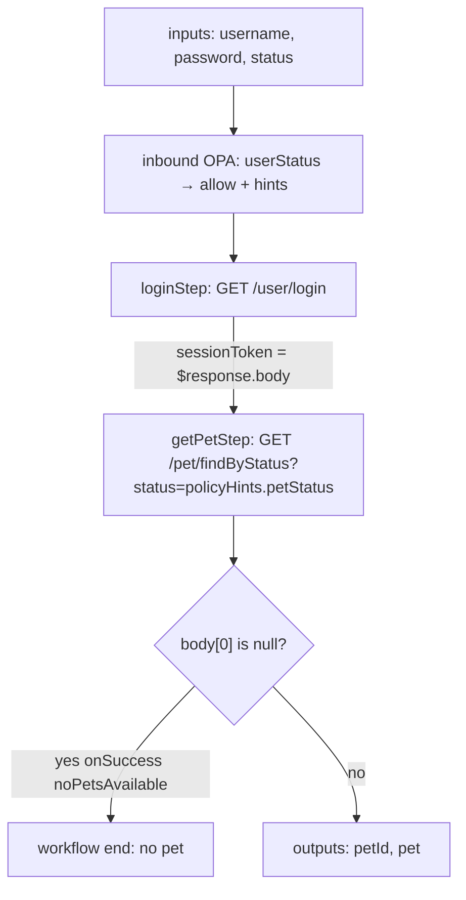
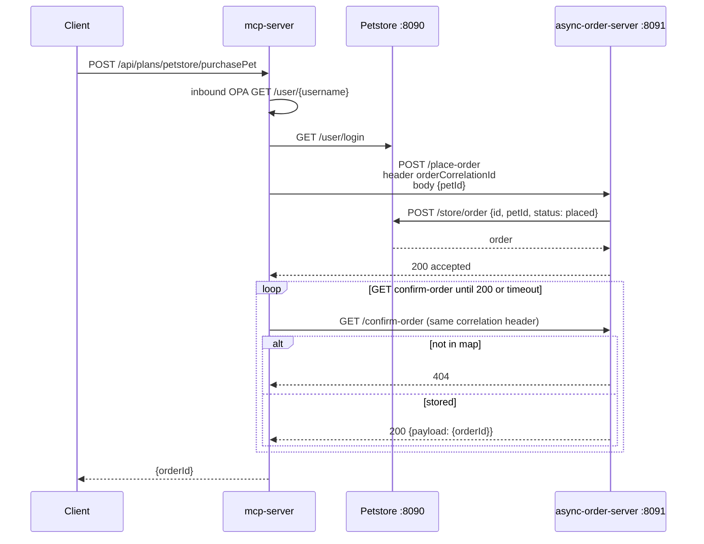
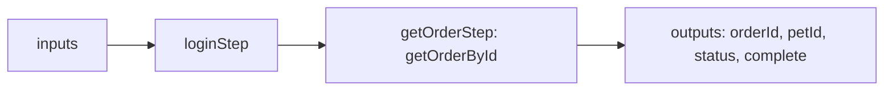
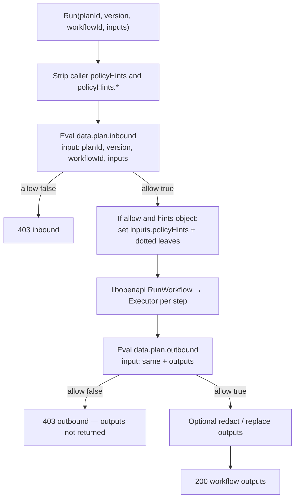

# Petstore demo: Arazzo plans on context-mesh-engine

This directory is the end-to-end reference for hosting [Arazzo](https://spec.openapis.org/arazzo/latest.html) workflows with [`context-mesh-engine`](../../docs/users/getting-started.md). It shows how a Go process becomes an MCP/REST plan host: you load documents, implement one HTTP `Executor`, optionally attach OPA, and the engine registers execute tools and REST routes.

Copy this example when you have real backends (OpenAPI and otherwise), not when you only need a stub. For load-from-disk without backends, use [arazzo-fs](../arazzo-fs/README.md). For engine-only embed, use [minimal](../minimal/README.md).

Default Petstore target is **local Docker**. Pass `-petstore hosted` for [petstore3.swagger.io](https://petstore3.swagger.io/).

## Table of contents

- [What this demo is](#what-this-demo-is)
- [Architecture](#architecture)
- [Quick start](#quick-start)
- [The Arazzo plan](#the-arazzo-plan)
  - [Catalog identity and sources](#catalog-identity-and-sources)
  - [Workflow: retrievePet](#workflow-retrievepet)
  - [Workflow: purchasePet](#workflow-purchasepet)
  - [Workflow: checkOrderStatus](#workflow-checkorderstatus)
  - [Runtime expressions](#runtime-expressions)
- [OPA policies](#opa-policies)
  - [Layout and wiring](#layout-and-wiring)
  - [When policy runs](#when-policy-runs)
  - [Inbound (`inbound.rego`)](#inbound-inboundrego)
  - [Outbound (`outbound.rego`)](#outbound-outboundrego)
  - [How `policyHints` reach Arazzo](#how-policyhints-reach-arazzo)
- [Building services on context-mesh-engine](#building-services-on-context-mesh-engine)
  - [What the engine owns](#what-the-engine-owns)
  - [Host process: `engine.New`](#host-process-enginenew)
  - [Loader](#loader)
  - [Executor](#executor)
  - [PolicyLoader](#policyloader)
  - [HTTP surfaces](#http-surfaces)
  - [AsyncAPI as OpenAPI HTTP](#asyncapi-as-openapi-http)
  - [Checklist for your own host](#checklist-for-your-own-host)
- [Operate the demo](#operate-the-demo)
  - [Petstore 3 in Docker](#petstore-3-in-docker)
  - [Hosted Petstore 3](#hosted-petstore-3)
  - [Run the Go servers](#run-the-go-servers)
  - [Seed users](#seed-users)
  - [REST: retrieve, purchase, check order](#rest-retrieve-purchase-check-order)
  - [MCP](#mcp)
- [Further reading](#further-reading)

## What this demo is

Three processes cooperate. Only **`mcp-server`** is a `context-mesh-engine` host. The other two are backends the host’s `Executor` calls.

| Directory | Process | Role |
| --- | --- | --- |
| [`petstore-openapi-server/`](petstore-openapi-server/) | `localhost:8090` | Official [Petstore 3](https://github.com/swagger-api/swagger-petstore) in Docker. OpenAPI base `http://localhost:8090/api/v3`. |
| [`async-order-server/`](async-order-server/) | `localhost:8091` | HTTP adapter for the spec’s AsyncAPI order channels. `POST /place-order` → Petstore `POST /store/order`. |
| [`mcp-server/`](mcp-server/) | `localhost:8080` | Engine host. Plan [`mcp-server/plans/petstore.arazzo.yaml`](mcp-server/plans/petstore.arazzo.yaml) (`x-planId: petstore`, version `0.0.1`). |

Workflows on the plan: `retrievePet`, `purchasePet`, `checkOrderStatus`. OPA modules live in [`mcp-server/policies/petstore/0.0.1/`](mcp-server/policies/petstore/0.0.1/) and gate those workflows by Petstore `userStatus`.

Do not run `mcp-server` at the same time as another example (or `cmd/engine`) on `localhost:8080`.

## Architecture



Request path inside the host (every REST execute and every MCP `run_*`):



`mcp-server` and `async-order-server` must target the **same** Petstore origin (`-petstore local|hosted` or `-petstore-url`).

## Quick start

From the **repository root**:

```bash
./examples/petstore/petstore-openapi-server/run.sh
# other terminals:
go run ./examples/petstore/async-order-server
go run ./examples/petstore/mcp-server
```

Seed users, then execute (see [Seed users](#seed-users) and [REST](#rest-retrieve-purchase-check-order)):

```bash
curl -s -X POST http://localhost:8080/api/plans/petstore/retrievePet \
  -H 'Content-Type: application/json' \
  -d '{"username":"browser","password":"abc123","status":"sold"}'
```

Default `mcp-server` is **REST only**. `-dual` also mounts MCP Streamable HTTP at `/mcp`.

## The Arazzo plan

File: [`mcp-server/plans/petstore.arazzo.yaml`](mcp-server/plans/petstore.arazzo.yaml).

It is based on the [Arazzo 1.1 specification example](https://spec.openapis.org/arazzo/latest.html), adapted for this engine and for stock libopenapi:

| Spec example | This plan |
| --- | --- |
| `arazzo: 1.1.0` | `arazzo: 1.0.1` (libopenapi validator accepts 1.0.x) |
| one mixed retrieve+purchase workflow | three workflows so policy can allow retrieve without purchase |
| `operationId: $sourceDescriptions…loginUser` | `operationId: loginUser` (OpenAPI id) |
| AsyncAPI send/receive | HTTP operations on [`sources/async-order.openapi.yaml`](mcp-server/sources/async-order.openapi.yaml) |
| `$message.payload` (1.1) | `$response.body` / JSON Pointers (1.0) |

### Catalog identity and sources

```yaml
info:
  version: 0.0.1
  x-planId: petstore
sourceDescriptions:
  - name: petStoreDescription
    url: ../sources/petstore.openapi.yaml
    type: openapi
  - name: asyncOrderApiDescription
    url: ../sources/async-order.openapi.yaml
    type: openapi
```

`engine.New` indexes `(x-planId, info.version)`. That pair becomes:

| Surface | Value |
| --- | --- |
| MCP tool | `run_petstore_v0.0.1` (default `run_{{.SafePlanID}}_v{{.SafeVersion}}`) |
| REST latest | `POST /api/plans/petstore/{workflowId}` |
| REST versioned | `POST /api/plans/petstore/v0.0.1/{workflowId}` |
| Generated OpenAPI | `GET /api/openapi/petstore` |

`info.version` must be semver **without** a leading `v` (`0.0.1`, not `v0.0.1`). URL path tokens prepend `v`. See [Arazzo plans — spec requirements](../../docs/users/arazzo.md#spec-requirements).

`FileLoader` is pointed at **`plans/` only**. Relative `sourceDescriptions[].url` resolve against the Arazzo file’s directory (`../sources/...`). Do not pass OpenAPI or `.rego` files to `FileLoader`.

OpenAPI operations used by the plan:

| Source | Operation | Used by |
| --- | --- | --- |
| Petstore | `loginUser` (`GET /user/login`) | all three workflows |
| Petstore | `GET /pet/findByStatus` | `retrievePet` (`operationPath` JSON Pointer) |
| Petstore | `getOrderById` (`GET /store/order/{orderId}`) | `checkOrderStatus` |
| Async adapter | `placeOrder` (`POST /place-order`) | `purchasePet` |
| Async adapter | `confirmOrder` (`GET /confirm-order`) | `purchasePet` |

### Workflow: retrievePet

**Purpose:** login, then return the first pet matching a status that **inbound policy** chooses. The caller’s `status` input is a hint for buyers only; browsers always search `available`.

**Inputs (required):** `username`, `password`, `status` (`available` \| `pending` \| `sold`). `policyHints` is declared so the schema documents the injected object; callers must not send it (the engine strips it).



Step bindings ([plan](mcp-server/plans/petstore.arazzo.yaml)):

1. **`loginStep`** — `operationId: loginUser`. Query `username` / `password` from `$inputs.*`. Success: `$statusCode == 200`. Output `sessionToken: $response.body` (Petstore returns a login string).
2. **`getPetStep`** — `operationPath` JSON Pointer to `GET /pet/findByStatus`. Query `status` is **`$inputs.policyHints.petStatus`**, not `$inputs.status`. Header `Authorization` is the session token. Success: 200. If `$response.body#/0 == null`, `onSuccess` type `end` stops without workflow outputs for a pet. Otherwise `petId` / `pet` from the first array element.

Workflow outputs: `$steps.getPetStep.outputs.petId` and `.pet`.

For a `browser` (`userStatus` 1), inbound sets `petStatus` to `available` even if the JSON body said `"status":"sold"`. Outbound redacts `pet.photoUrls` in that mode.

### Workflow: purchasePet

**Purpose:** login, place an order on the async adapter, poll until confirmation, return `orderId`. Requires inbound **buy** (`userStatus` 2). A `browser` call is **403** before any step runs.

**Inputs (required):** `username`, `password`, `petId`, `orderCorrelationId` (any unique string; AsyncAPI `orderRequestId`).



Steps:

1. **`loginStep`** — same as retrieve.
2. **`purchasePetStep`** — `operationPath: $sourceDescriptions.asyncOrderApiDescription.placeOrder`. Header `orderCorrelationId` from `$inputs.orderCorrelationId`. JSON body `{ petId: $inputs.petId }`. The executor treats source name `asyncOrderApiDescription` as the adapter origin (`-async-order-url`, default `http://localhost:8091`).
3. **`confirmPetPurchaseStep`** — `confirmOrder`. Same correlation header. Output `orderId: $response.body#/payload/orderId` (matches the adapter’s JSON envelope, not a Petstore `Order` object).

The executor **polls** GET confirm for up to 6 seconds on HTTP 404 (`confirmWait` in [`mcp-server/executor.go`](mcp-server/executor.go)). The adapter stores confirmations in memory keyed by correlation id ([`async-order-server/server.go`](async-order-server/server.go)).

Local Docker Petstore does not allocate order ids (omit `id` and you get `0`). The adapter always POSTs a generated non-zero `id`; hosted petstore3’s id is used when it returns non-zero.

### Workflow: checkOrderStatus

**Purpose:** login and `GET /store/order/{orderId}`. Buyers only.

**Inputs (required):** `username`, `password`, `orderId`.



`status` is whatever Petstore stored (`placed`, `approved`, `delivered`). Petstore has **no PUT** for orders; status is set at `POST /store/order`. After `purchasePet`, `checkOrderStatus` reads that row back.

### Runtime expressions

Expressions the plan relies on:

| Expression | Meaning in this engine |
| --- | --- |
| `$inputs.username` | Caller input key `username` |
| `$inputs.policyHints.petStatus` | Single input **name** `policyHints.petStatus` (see [hints](#how-policyhints-reach-arazzo)) |
| `$steps.loginStep.outputs.sessionToken` | Prior step output |
| `$statusCode == 200` | `ExecutionResponse.StatusCode` |
| `$response.body` | Decoded JSON body |
| `$response.body#/0/id` | JSON Pointer into the body |
| `$sourceDescriptions.petStoreDescription.url` | Resolved OpenAPI source URL (used in `operationPath`) |

The engine does not evaluate expressions itself; libopenapi’s Arazzo runtime does, using the `Executor` result for each step.

## OPA policies

Directory: [`mcp-server/policies/petstore/0.0.1/`](mcp-server/policies/petstore/0.0.1/).

Packages **must** be `plan.inbound` and `plan.outbound`. The engine evaluates `data.plan.inbound` and `data.plan.outbound`. Missing or non-boolean `allow` is **deny**. Use `default allow := false`.

### Layout and wiring

`FilePolicyLoader` reads `{Dir}/{planId}/{version}/`:

```text
mcp-server/policies/
  petstore/
    0.0.1/
      inbound.rego
      outbound.rego
```

`planId` and `version` are single path segments matching `x-planId` and `info.version` (`0.0.1`, not `v0.0.1`). Optional `data.json` in that folder is merged with `FilePolicyLoader.Data` (struct keys win). This host injects the Petstore origin at process start:

```go
PolicyLoader: &arazzo.FilePolicyLoader{
    Dir:  policiesDir(),
    Data: map[string]any{"petstoreBase": petstoreBase},
},
```

Rego then uses `data.petstoreBase` in `http.send`. Lookups run **on execute**, not in `engine.New`. Compiled bundles are cached for `Options.PolicyCacheTTL` (default 5 minutes). Load/compile failure is **500** (fail closed) unless a previously compiled bundle is still cached. Deny is **403**.

Do not put `.rego` on `ArazzoLoaders`.

### When policy runs



OPA `input` for inbound:

```json
{
  "planId": "petstore",
  "version": "0.0.1",
  "workflowId": "retrievePet",
  "inputs": { "username": "browser", "password": "abc123", "status": "sold" }
}
```

Outbound adds `"outputs": { ... }` (the Arazzo workflow outputs map) and sees `inputs` **after** hints were applied (`policyHints` nested object is present).

### Inbound (`inbound.rego`)

File: [`inbound.rego`](mcp-server/policies/petstore/0.0.1/inbound.rego).

1. Read `username` from `input.inputs`.
2. `http.send` `GET {data.petstoreBase}/user/{username}` (`raise_error: false`). Petstore fetch user is **GET**; POST is 405.
3. `user_status` is `userStatus` from a 200 JSON body, otherwise **1** (missing user, error, or non-object body).
4. Allow sets:
   - `user_status == 2` → `{retrievePet, purchasePet, checkOrderStatus}`
   - otherwise → `{retrievePet}` only
5. Hints:
   - `user_status != 2` → `{"mode": "read", "petStatus": "available"}`
   - `user_status == 2` → `{"mode": "buy", "petStatus": object.get(input.inputs, "status", "available")}`

| Username | Password | `userStatus` | Allowed workflows | `policyHints.petStatus` |
| --- | --- | --- | --- | --- |
| `browser` | `abc123` | `1` | `retrievePet` only | always `available` |
| `buyer` | `abc123` | `2` | retrieve, purchase, check order | caller `status`, default `available` |

A `browser` `purchasePet` is denied **before** login. Policy is the source of truth for hints; forged `policyHints` in the request body are discarded.

### Outbound (`outbound.rego`)

File: [`outbound.rego`](mcp-server/policies/petstore/0.0.1/outbound.rego).

- `allow` if `input.outputs` is an object (including `{}`).
- If `input.inputs.policyHints.mode == "read"` and `workflowId == "retrievePet"`, `redact := ["/pet/photoUrls"]`.

Redact entries are RFC 6901 pointers into **workflow outputs**. Default mask is JSON `null`. Outbound deny hides outputs even though steps already ran.

### How `policyHints` reach Arazzo

Stock libopenapi treats `$inputs.policyHints.petStatus` as the **single map key** `"policyHints.petStatus"`, not a nested walk of `policyHints` then `petStatus`.

On inbound allow the engine therefore stores both:

- `inputs["policyHints"]` — nested object (OPA outbound uses `object.get(input.inputs, "policyHints", {})`)
- `inputs["policyHints.petStatus"]`, `inputs["policyHints.mode"]` — dotted leaves for Arazzo `$inputs.policyHints.*`

Caller keys `policyHints` and `policyHints.*` are stripped first. Implementation: `applyInbound` / `flattenPolicyHints` in `internal/plans/policy.go`. Public constant: [`arazzo.PolicyHintsKey`](../../arazzo/policy.go).

When you write a plan, use `$inputs.policyHints.<leaf>` for injected leaves. Do not assume `$inputs.policyHints` as an object is visible to step parameters unless you also flatten (the engine does).

## Building services on context-mesh-engine

The engine is a **host**, not a pet-store client. You supply catalogs, backends, and policy. Public packages: `engine` and `arazzo`. Do not import `internal/`.

### What the engine owns

| The engine | You |
| --- | --- |
| Parse/validate Arazzo, resolve `sourceDescriptions` | `Loader` that yields YAML/JSON bytes |
| MCP `run_*` + REST `/plans` + generated OpenAPI | `Executor` that performs each step’s HTTP call |
| Optional OPA compile/eval around `Run` | `PolicyLoader` + `.rego` |
| HTTP listener (`ListenAndServe`) or `Handler()` | Process flags, TLS, extra REST controllers |
| Tool names from `x-planId` + version | Optional `ToolDoc` / `ToolHelpLookup` |

Nil `ArazzoLoaders`: no plan tools or plan REST. Nil `ArazzoExecutor`: catalog and OpenAPI still work; execute is **501**. Nil `PolicyLoader`: skip inbound/outbound. Nil `QueryMatcher`: MCP `query` and `POST /plans/query` are **not** registered (this demo leaves it unset).

### Host process: `engine.New`

[`mcp-server/main.go`](mcp-server/main.go) is the pattern to copy:

```go
e, err := engine.New(engine.Options{
    Addr: *addr,
    ArazzoLoaders: []arazzo.Loader{
        arazzo.NewFileLoader(plansDir()),
    },
    ArazzoExecutor: newHTTPExec(*asyncURL, petstoreBase),
    PolicyLoader: &arazzo.FilePolicyLoader{
        Dir:  policiesDir(),
        Data: map[string]any{"petstoreBase": petstoreBase},
    },
    PublicBaseURL:  "http://" + *addr,
    DualMCPandREST: *dual,
})
if err != nil {
    log.Fatal(err)
}
if err := e.ListenAndServe(ctx); err != nil {
    log.Fatal(err)
}
```

`plansDir()` / `policiesDir()` use `runtime.Caller` so `go run` and `go test` resolve `plans/` and `policies/` next to `main.go`, independent of cwd.

`PublicBaseURL` is the origin written into REST tool descriptions (`GET /api/tools`). It is not inferred from `Addr`. Empty → path-only URLs.

`New` **fails** if a document cannot be parsed, Arazzo validation fails, sources cannot be resolved, two documents share `(x-planId, version)`, `info.version` is not semver (or starts with `v`), or MCP tool names collide.

### Loader

```go
arazzo.NewFileLoader("/path/to/plans")
```

Walks recursively for `.yaml`, `.yml`, `.json`. `Source.BaseURL` is `file://` + the Arazzo file’s directory **with a trailing slash** so `../sources/openapi.yaml` resolves correctly (RFC 3986).

For HTTP, embed, or object storage, implement `arazzo.Loader` (`Load(ctx) ([]Source, error)`). Honor `ctx`. Set `BaseURL`. Duplicate plan identities across loaders fail `New`.

### Executor

Type: `arazzo.Executor` (alias of libopenapi `arazzo.Executor`).

```go
Execute(ctx context.Context, req *arazzo.ExecutionRequest) (*arazzo.ExecutionResponse, error)
```

Each workflow step is **one** `Execute` call. This demo’s implementation is [`httpExec`](mcp-server/executor.go):

1. Resolve HTTP method and path from `OperationPath` (`#/paths/~1pet~1findByStatus/get`) or `operationId` on `req.Source.OpenAPIDocument`.
2. Choose origin: Petstore base URL unless the source is `asyncOrderApiDescription`, then `-async-order-url`.
3. Apply OpenAPI parameter `in` (path / query / header). Remaining names: `Authorization` and correlation headers go to headers; other names to query.
4. Marshal `RequestBody` as JSON when present.
5. Return `ExecutionResponse{StatusCode, Headers, Body, URL, Method}`. `Body` is decoded JSON (`UseNumber` then canonicalized to `int64` when possible) so JSON Pointers and success criteria see numbers, not strings.

Return a **response** (not a Go error) for HTTP 4xx/5xx the plan should observe (`$statusCode == 200` fails the step). Return a Go error for transport failures.

Async confirm: if the source is `asyncOrderApiDescription` and the method is GET, 404 is retried until `confirmWait` (6s).

Your executor can be gRPC, a message bus, or a stub. The plan only needs `StatusCode` and a `Body` the expressions understand. [arazzo-fs](../arazzo-fs/README.md) returns `200` and `{"status":"ok"}` for every step.

### PolicyLoader

```go
type PolicyLoader interface {
    Load(ctx context.Context, req PolicyRequest) (*PolicyBundle, error)
}
```

`PolicyRequest` is `{PlanID, Version}`. Nil `*PolicyBundle` means no policy for that key (not an error). Implement this if policies live in a DB or sidecar; `FilePolicyLoader` is the filesystem default.

Rego decision objects:

```json
{ "allow": true, "hints": { "petStatus": "available", "mode": "read" } }
```

```json
{ "allow": true, "redact": ["/pet/photoUrls"], "mask": "***" }
```

`hints` is inbound-only. Outbound may set `outputs` (replaces the workflow map and ignores `redact`) or `redact` pointers. Details: [Adapters — PolicyLoader](../../docs/users/adapters.md#policyloader).

### HTTP surfaces

`DualMCPandREST`, `MCPOnly`, and `RESTOnly` are mutually exclusive. **All false (default) = REST only**; `/mcp` is not mounted. `-dual` sets `DualMCPandREST`.

When `ArazzoLoaders` is set, `New` registers:

| Surface | Path / name |
| --- | --- |
| REST execute latest | `POST {APIPrefix}/plans/{planId}/{workflowId}` |
| REST execute versioned | `POST {APIPrefix}/plans/{planId}/{version}/{workflowId}` |
| REST OpenAPI | `GET {APIPrefix}/openapi/{planId}` |
| REST tools | `GET {APIPrefix}/tools` (MCP `tools/list` envelope; REST descriptions) |
| REST health | `GET {APIPrefix}/health` |
| MCP `run_*` | only if MCP is mounted (`-dual` or `MCPOnly`) |
| MCP `query` | only if `QueryMatcher` is set **and** MCP is mounted |

REST POST body is the workflow **inputs object** (no `workflowId` wrapper). MCP arguments wrap `workflowId` + `inputs`. HTTP 200 body is the Arazzo **outputs** map.

| HTTP status | Meaning |
| --- | --- |
| 200 | Outputs JSON |
| 400 | Invalid JSON, workflow failure, other runner error |
| 403 | Inbound or outbound deny |
| 404 | Unknown plan, version, or workflow |
| 500 | Policy load/compile failed |
| 501 | No executor |

### AsyncAPI as OpenAPI HTTP

The official Arazzo 1.1 example uses AsyncAPI 3 send/receive. This engine’s executor is HTTP-shaped, so the plan’s second source is an OpenAPI **binding** of those channels:

- Spec: [`async-order-server/pet-asyncapi.yaml`](async-order-server/pet-asyncapi.yaml)
- Binding: [`mcp-server/sources/async-order.openapi.yaml`](mcp-server/sources/async-order.openapi.yaml)
- Server: [`async-order-server/`](async-order-server/)

| HTTP | AsyncAPI |
| --- | --- |
| `POST /place-order` | `placeOrder` |
| `GET /confirm-order` | `confirmOrder` |
| Header `orderCorrelationId` / `orderRequestId` | correlation |
| Confirm body `{ headers, payload: { orderId } }` | message envelope |

That is the pattern for any non-OpenAPI backend: publish a small OpenAPI document as a `sourceDescription`, and implement the HTTP in a sidecar (or inside the executor). The engine never speaks AsyncAPI natively.

### Checklist for your own host

1. Author Arazzo 1.0.x with `info.x-planId` and semver `info.version` (no leading `v`).
2. Put OpenAPI (and adapter OpenAPI) beside the plan; use relative `sourceDescriptions` URLs.
3. Point `FileLoader` at the **plans directory only**.
4. Implement `Executor`: map `operationId` / `operationPath` to your origins; set `StatusCode` and JSON `Body`.
5. Optional: `{policies}/{planId}/{version}/inbound.rego` and `outbound.rego`; pass `FilePolicyLoader{Dir, Data}`.
6. `engine.New` + `ListenAndServe` (or `Handler()` on your `http.Server`).
7. Default REST; `-dual` when an MCP client needs `/mcp`.
8. Leave `QueryMatcher` nil until you have a real matcher; agents call `run_*` or REST execute.
9. Exercise deny (403), missing executor (501), and generated `GET /api/openapi/{planId}`.

Smaller embed without plans: [minimal](../minimal/README.md). Plans without backends: [arazzo-fs](../arazzo-fs/README.md). Full `Options`: [Configuration](../../docs/users/configuration.md).

## Operate the demo

### Petstore 3 in Docker

Needs [Docker](https://docs.docker.com/get-docker/) on `PATH`. Scripts pull [swaggerapi/petstore3:latest](https://hub.docker.com/r/swaggerapi/petstore3) **only if** `context-mesh-petstore3:local` is missing. If pull times out, the Docker VM often cannot reach Hub while a VPN is up — disconnect VPN, restart Docker Desktop, retry, or use `-petstore hosted`.

From the **repository root**:

```bash
./examples/petstore/petstore-openapi-server/run.sh
```

Windows (PowerShell):

```powershell
./examples/petstore/petstore-openapi-server/run.ps1
```

Force a fresh image: `run.sh --rebuild` / `run.ps1 -Rebuild`.

Host port **8090** avoids clashing with `mcp-server` on 8080 (the process inside the container still uses 8080).

```bash
curl -s http://localhost:8090/api/v3/openapi.json | head
curl -s 'http://localhost:8090/api/v3/pet/findByStatus?status=available' | head
```

Stop: `docker stop petstore-openapi-server`. Image names and port: [petstore-openapi-server/README.md](petstore-openapi-server/README.md). If you change the port, pass `-petstore-url http://localhost:PORT/api/v3` to **both** Go processes.

### Hosted Petstore 3

Skip Docker. The public demo is often flaky (`/pet/findByStatus`, `/store/order`).

```bash
go run ./examples/petstore/async-order-server -petstore hosted
go run ./examples/petstore/mcp-server -petstore hosted          # REST only
go run ./examples/petstore/mcp-server -dual -petstore hosted    # REST + /mcp (instead of the line above)
```

Direct checks use `https://petstore3.swagger.io/api/v3/...`.

Custom origin:

```bash
go run ./examples/petstore/mcp-server -petstore-url http://127.0.0.1:8090/api/v3
```

### Run the Go servers

For **local** Petstore, start Docker first. Then from the **repository root**:

```bash
go run ./examples/petstore/async-order-server
go run ./examples/petstore/mcp-server
```

Optional flags:

```bash
go run ./examples/petstore/async-order-server -addr localhost:8091 -petstore local
go run ./examples/petstore/mcp-server -addr localhost:8080 -async-order-url http://localhost:8091 -petstore local
go run ./examples/petstore/mcp-server -dual
```

Checks:

```bash
curl -s http://localhost:8091/health
curl -s http://localhost:8080/api/health
curl -s http://localhost:8080/api/tools
curl -s http://localhost:8080/api/openapi/petstore
```

### Seed users

Inbound policy calls `GET {petstore}/user/{username}` and reads `userStatus` ([User](https://petstore3.swagger.io/#/user/createUser)). Seed before execute:

```bash
curl -s -X POST http://localhost:8090/api/v3/user \
  -H 'Content-Type: application/json' \
  -d '{"username":"browser","password":"abc123","userStatus":1}'

curl -s -X POST http://localhost:8090/api/v3/user \
  -H 'Content-Type: application/json' \
  -d '{"username":"buyer","password":"abc123","userStatus":2}'
```

Hosted origin: `https://petstore3.swagger.io/api/v3/user`.

### REST: retrieve, purchase, check order

A `browser` login can only retrieve. Inbound forces `petStatus` to `available`:

```bash
curl -s -X POST http://localhost:8080/api/plans/petstore/retrievePet \
  -H 'Content-Type: application/json' \
  -d '{"username":"browser","password":"abc123","status":"sold"}'
```

`buyer` may pass `status` through as `policyHints.petStatus`:

```bash
curl -s -X POST http://localhost:8080/api/plans/petstore/retrievePet \
  -H 'Content-Type: application/json' \
  -d '{"username":"buyer","password":"abc123","status":"available"}'
```

Versioned URL: `POST /api/plans/petstore/v0.0.1/retrievePet`. Pick a `petId` from the response (or `pet.id`). Direct Petstore: `GET http://localhost:8090/api/v3/pet/1`.

Purchase requires the async adapter and a **buyer**. A `browser` call returns **403**. `orderCorrelationId` is any unique string:

```bash
curl -s -X POST http://localhost:8080/api/plans/petstore/purchasePet \
  -H 'Content-Type: application/json' \
  -d '{"username":"buyer","password":"abc123","petId":1,"orderCorrelationId":"demo-order-1"}'
```

Save `orderId`, then:

```bash
curl -s -X POST http://localhost:8080/api/plans/petstore/checkOrderStatus \
  -H 'Content-Type: application/json' \
  -d '{"username":"buyer","password":"abc123","orderId":1}'
```

Replace `orderId` with the id from `purchasePet`.

Petstore has no PUT for orders. To plant a known id:

```bash
curl -s -X POST http://localhost:8090/api/v3/store/order \
  -H 'Accept: application/json' -H 'Content-Type: application/json' \
  -d '{"id":900001,"petId":1,"quantity":1,"status":"placed","complete":false}'

curl -s -X POST http://localhost:8080/api/plans/petstore/checkOrderStatus \
  -H 'Content-Type: application/json' \
  -d '{"username":"buyer","password":"abc123","orderId":900001}'
```

Direct GET (no engine): `curl -s -H 'Accept: application/json' http://localhost:8090/api/v3/store/order/900001`.

### MCP

Start with `-dual` so Streamable HTTP is at **`http://localhost:8080/mcp`** (not `/mcp/`).

```bash
go run ./examples/petstore/mcp-server -dual
```

Cursor: Settings → MCP → add a **URL** server `http://localhost:8080/mcp`. Restart the agent chat so it reloads tools.

This example does not set `QueryMatcher`, so `query` is not registered. The plan registers:

| Tool | Use |
| --- | --- |
| `run_petstore_v0.0.1` | `workflowId` is `retrievePet`, `purchasePet`, or `checkOrderStatus` |

Example prompts:

- “Using the petstore MCP tools, retrieve an available pet. Login as browser / abc123.”
- “Purchase pet id 1 with orderCorrelationId demo-order-1, login as buyer / abc123.”
- “Check order status for orderId \<id from purchase\>, same buyer login.”

The agent should call `run_petstore_v0.0.1` with:

```json
{
  "workflowId": "retrievePet",
  "inputs": { "username": "browser", "password": "abc123", "status": "available" }
}
```

```json
{
  "workflowId": "purchasePet",
  "inputs": {
    "username": "buyer",
    "password": "abc123",
    "petId": 1,
    "orderCorrelationId": "demo-order-1"
  }
}
```

```json
{
  "workflowId": "checkOrderStatus",
  "inputs": { "username": "buyer", "password": "abc123", "orderId": 900001 }
}
```

Go client: [docs/users/configuration.md](../../docs/users/configuration.md#mcp-client) (`mcp.StreamableClientTransport{Endpoint: "http://localhost:8080/mcp"}`).

REST equivalent of `tools/list` (no session): `curl -s http://localhost:8080/api/tools`.

MCP handshake: POST JSON-RPC `initialize`, copy `Mcp-Session-Id` from the response headers, then `tools/list`. The engine answers POST with SSE (`event: message` / `data: …`).

```bash
curl -sS -D - -X POST http://localhost:8080/mcp \
  -H 'Content-Type: application/json' \
  -H 'Accept: application/json, text/event-stream' \
  -d '{"jsonrpc":"2.0","id":1,"method":"initialize","params":{"protocolVersion":"2025-03-26","capabilities":{},"clientInfo":{"name":"curl","version":"0"}}}'
```

```bash
curl -sS -X POST http://localhost:8080/mcp \
  -H 'Content-Type: application/json' \
  -H 'Accept: application/json, text/event-stream' \
  -H 'Mcp-Session-Id: <session>' \
  -d '{"jsonrpc":"2.0","id":2,"method":"tools/list"}' \
  | awk '/^data: /{print substr($0,7)}' | jq -r '.result.tools[].name'
```

Replace `<session>` with the `Mcp-Session-Id` value. Expect `run_petstore_v0.0.1`.

## Further reading

| Topic | Doc |
| --- | --- |
| `engine.Options`, listener vs `Handler()` | [Configuration](../../docs/users/configuration.md) |
| Loader, Executor, PolicyLoader, QueryMatcher | [Adapters](../../docs/users/adapters.md) |
| Catalog, MCP `run_*`, REST execute, spec rules | [Arazzo plans](../../docs/users/arazzo.md) |
| Which example to copy | [Examples](../../docs/users/examples.md) |
| This host, short form | [mcp-server/README.md](mcp-server/README.md) |
| Adapter HTTP | [async-order-server/README.md](async-order-server/README.md) |
| Docker Petstore | [petstore-openapi-server/README.md](petstore-openapi-server/README.md) |
